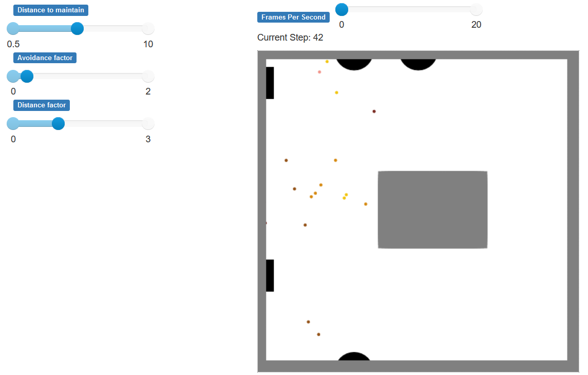

# Programmeerproject# project-PieterO99

##### Model: studenten die door de hal van het sciencepark lopen

Dit model bestaat uit een boid agent die een lopende student modelleert. De agent heeft een positie `boid.pos`, constante snelheid `boid.speed` en een richting `boid.velocity`, die hij elke stap update. De agent verplaatst zich hiermee elke stap van het model. Voor de visualiatie heb ik [dit template](https://github.com/projectmesa/mesa/tree/main/examples/boid_flockers) van EwoutH gebruikt. [^1]

De richting van de agent wordt bepaald door twee factoren: 
- het ontwijken van andere boids en obstakels (`avoid()`)
- zijn bestemming (`approach_destination()`)

### Onderzoeksvraag: 
***"Hoe hangt de flow van een gebouw af van de mate waarin mensen afstand willen houden?"***

In mijn project is de flow de tijd (het aantal stappen) waarin alle mensen hun bestemming hebben bereikt.
De mate waarin mensen afstand willen houden slaat op drie factoren: de afstand die ze aan willen houden (`boid.separation`), hoe sterk ze dit willen doen (`boid.separate`) en hoe sterk de invloed van afstand is op het ontwijkgedrag (`boid.distance_factor`).

### Visualisatie model

# [screencasting](https://video.uva.nl/media/video1827382427/0_zclgkj0z)

__License: *Public Domain Release*__

[^1]: simple_continuous_canvas.js, SimplecontinuousModule.py en run.py zijn letterlijk overgenomen. De bestanden model.py, server.py en boid.py heb ik als template gebruikt, maar behoorlijk aangepast.